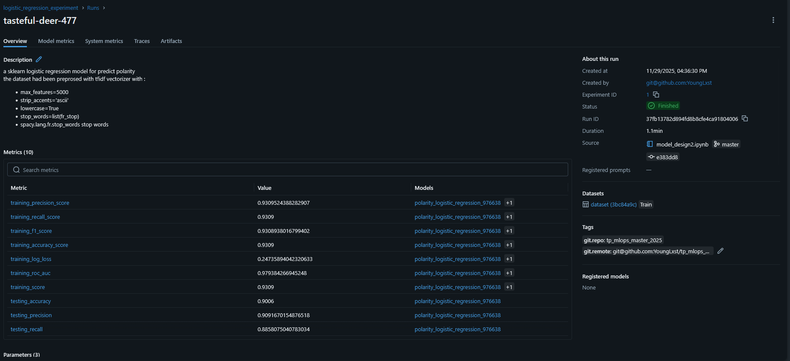
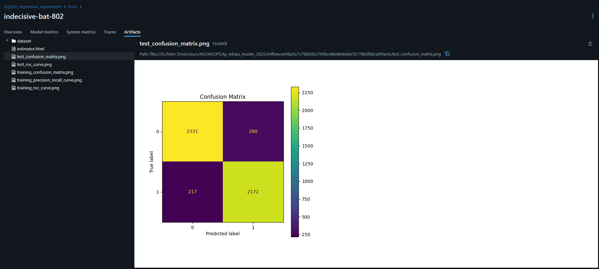

# Sentiment Polarity Classification – MLOps Project (session 1)

This repository contains my work for the first sessions of an MLOps course. The objective is to build a complete machine-learning workflow for sentiment polarity prediction on textual reviews, including data preparation, modeling, evaluation, reproducibility, and experiment management.

---

## Project Overview

The goal of this project is to classify film reviews as **positive** or **negative**.
To achieve this, I built:

* A full project environment using **Git**, **Conda**, and **requirements management**
* Multiple **notebooks** for exploration, preprocessing, and model design
* A custom **PyTorch MLP classifier (PolarityNN)** used as a baseline model
* A scikit learn **LogistcRegression** model
* A preprocessing workflow based on **scikit-learn feature extraction**
* A modular structure to support future sessions (MLflow, hyperparameter optimization, pipelines…)

This project follows MLOps best practices: version control, environment isolation, documentation, and modular code.

---

## Repository Structure

```
mlops_project/
│── README.md
│── requirements.txt
│── notebooks/
│   ├── model_design.ipynb
│── data/
│   ├── train/
│   ├── test/
│   ├── validate/
│── model/
│   ├── Polaritynn.py
|   ├── trained/
│── .gitignore
```

---

## Installation

### 1. Clone the repository

```bash
git clone https://github.com/<your-username>/mlops_project.git
cd mlops_project
```

### 2. Create the Conda environment

```bash
conda create --name mlops python=3.11
conda activate mlops
```

### 3. Install Python dependencies

```bash
pip install -r requirements.txt
```

Make sure to update `requirements.txt` whenever a new library is added.

---

## Dataset

Download the dataset provided for the MLOps course:

➡️ [https://drive.google.com/file/d/1i2T30NH_PCwDJD2si7Rp_ZMPxPYBSatb/view](https://drive.google.com/file/d/1i2T30NH_PCwDJD2si7Rp_ZMPxPYBSatb/view)

Extract the archive and place the folders in:

```
data/train/
data/test/
data/validate/
```

Each folder contains text reviews and their associated polarity labels.

---

## Exploratory Data Analysis

EDA is performed in the notebook:

```
notebooks/exploratory_analysis.ipynb
```

The analysis includes:

* Inspection of missing values
* Distribution of polarity scores
* Basic statistics
* First inspection of text quality

Libraries used: **pandas**, **matplotlib**, **scikit-learn**.

---

## Data Preprocessing

Text preprocessing is based on **scikit-learn** feature extraction tools:

* `TfidfVectorizer`
* Removal of **French stop words**
* Vocabulary limitation (`max_features=5000`)
* Token normalization

Stop words are imported from **spaCy (fr_core_news_sm)**.

Documentation and implementation are also detailed inside the notebook:

```
notebooks/model_design.ipynb
```

---

## Model – PolarityNN (PyTorch MLP)

The main model implemented for this session is a custom PyTorch neural network named **PolarityNN**, located in:

```
src/model_polaritynn.py
```

### Model Architecture

* Input layer: 5000-dimensional bag-of-words vector
* Hidden layer 1: 128 units + ReLU + Dropout
* Hidden layer 2: 64 units + ReLU + Dropout
* Output layer: 1 neuron + Sigmoid (binary classification)

### Key features

* Custom training loop with progress monitoring
* Flexible optimizer & loss selection
* `.fit()`, `.score()`, `.predict()` implemented for sklearn-style usage
* Automatic model naming with timestamp
* Model saving utility

---

## Training the Model

Example training script (inside `model_design.ipynb`):

```python
from src.model_polaritynn import PolarityNN
from torch.utils.data import DataLoader, TensorDataset

model = PolarityNN(input_size=5000, hidden_size=128)

train_loader = DataLoader(train_dataset, batch_size=32, shuffle=True)
val_loader   = DataLoader(val_dataset, batch_size=32)

model.fit(
    train_loader=train_loader,
    val_loader=val_loader,
    num_epochs=10,
    learning_rate=0.001,
    optimizer="adam",
    criterion="bceloss"
)
```

---

## Evaluation

Metrics computed with `sklearn.metrics`:

* **Accuracy**
* **Precision**
* **Recall**

### Interpretation in this context

* **Accuracy**: fraction of correctly classified reviews
* **Precision**: among predicted “positive”, how many are truly positive
* **Recall**: among truly positive reviews, how many are detected

For sentiment classification, **precision and recall are more meaningful than accuracy**, especially in case of unbalanced classes.

# MLflow Tracking — Step-by-Step Guide (session 2)

## 1. Environment & server setup 

1. Install all requirement in your conda environment:

```bash
pip install
```

## 2. **Launching MLflow**

Once the setup is complete, starting the MLflow Tracking Server becomes very simple.
Instead of typing the full command manually each time, you can simply run one of the provided launcher scripts:

* **`start_mlflow.sh`** for Linux and macOS
* **`start_mlflow.bat`** for Windows
* **`start_mlflow.py`** for a fully cross-platform solution (works on Windows, Linux, and macOS)

Each script automatically:

1. Navigates to the correct directory
2. Ensures the required folders exist
3. Starts the MLflow server with the appropriate configuration

To launch MLflow, you only need to execute one of these scripts depending on your operating system. The server will then start and become accessible through the web interface at:

👉 **[http://localhost:5000](http://localhost:5000)**

This greatly simplifies the workflow and ensures that MLflow is always launched with consistent parameters.

## 3. High level workflow

1. Activate `mlflow.sklearn.autolog()` **before** training so MLflow captures fit/validation info.
2. Set tracking URI and experiment name.
3. Start a run (`with mlflow.start_run():`).
4. Log manual tags for code identity, dataset, preprocessing and description (these are *not* reliably captured by autolog in notebooks).
5. Log hyperparameters (either manually or let autolog capture them — but still log dataset and code details manually).
6. Train the model and let autolog record training metrics/artifacts.
7. Compute and log custom evaluation metrics (precision, recall, f1, confusion matrix, ROC AUC, etc).
8. Log dataset preview or schema as artifact.
9. Log the trained model explicitly (optional — autolog may already do this).
10. Close the run (context manager `with` will do this).


## 4. Corrected and complete example code (copy into your notebook)


```python
import mlflow
import mlflow.sklearn
from sklearn.linear_model import LogisticRegression
import datetime

# --- 0. Configure tracking and experiment ---
mlflow.set_tracking_uri("http://localhost:5000")
mlflow.set_experiment("logistic_regression_experiment")

# --- 1. Enable autolog BEFORE training starts ---
mlflow.sklearn.autolog()

# --- 2. Start run and log everything required ---
with mlflow.start_run():

    # --- 2.1 Manual hyperparameters (autolog will also capture many) ---
    hyperParam = {
        'C': 1.25,
        'penalty': 'l2',
        'solver': 'saga',
        'max_iter': 1000
    }
    mlflow.log_params(hyperParam)

    # --- 2.2 Required tags for reproducibility & traceability (manually set) ---
    mlflow.set_tags({
        "mlflow.user": git_user,                       # e.g. "j.doe"
        "git.repo": git_repo,                          # e.g. "git@github.com:me/repo.git"
        "git.remote": remote,                          # e.g. "origin"
        "mlflow.source.git.branch": git_branch,        # e.g. "feature/mlflow-tp"
        "mlflow.source.git.commit": git_commit,        # e.g. "a1b2c3d4"
        "mlflow.source.name": "notebook/model_design_2.ipynb",
        "mlflow.source.type": "NOTEBOOK",
        "mlflow.note.content": desc                    # short free-form description
    })

    # --- 2.3 Log dataset identification and small preview as an artifact ---
    mlflow.log_artifact("../data/dataset_preview.csv", artifact_path="dataset")

    # --- 3. Train model (autolog will capture training metrics) ---
    model = LogisticRegression(**hyperParam)
    model.fit(X_train, y_train)

    # --- 4. Predictions and custom evaluation metrics (must be logged manually) ---
    preds = model.predict(X_test)

    # Example compute_metrics function should return accuracy, precision, recall (or compute inline)
    acc, prec, rec = compute_metrics(y_test, preds)

    # Log custom metrics required by the TP (precision/recall are essential for classification)
    mlflow.log_metrics({
        "testing_accuracy": acc,
        "testing_precision": prec,
        "testing_recall": rec
    })

    # --- 5. (Optional) Save the sklearn model explicitly (autolog may already have saved it) ---
    timestamp = datetime.datetime.now().strftime("%Y%m%d_%H%M%S")
    mlflow.sklearn.log_model(sk_model=model, artifact_path=f"model_{timestamp}", registered_model_name="polarity_logistic_regression")

# run is closed automatically by the context manager
```

## 5. What `mlflow.sklearn.autolog()` records 

`autolog()` automatically records during training for scikit-learn:

* start/end timestamps,
* model object (artifact),
* some hyperparameters detected from the estimator constructor,
* training/validation scores (if available),
* training duration,
* environment information (sklearn version and other metadata),
* warnings and stack traces.

autolog is limited in notebooks for code source/commit/branch detection and does not identify dataset or free-text description. That's why manual tags and artifacts are needed.

## 6. What you must log manually 

The TP requires that the following are stored — autolog does *not* reliably capture them from notebooks:

* `mlflow.source.name` — the name of the notebook or script (store as tag).
  *Why:* to know which code produced the run.
* `mlflow.source.git.commit` — git commit hash (tag).
  *Why:* to reproduce exact code.
* `mlflow.source.git.branch` — git branch name (tag).
  *Why:* to know which branch/context was used.
* Dataset identification: path, version, small preview CSV (artifact).
  *Why:* to ensure the same input data can be used to reproduce results.
* Preprocessing / pipeline description: either tags or a small text artifact (e.g., `preprocessing.txt`).
  *Why:* preprocessing often changes results drastically.
* Free text description: `mlflow.note.content` or an artifact `README.txt`.
  *Why:* human description of experiment intent, caveats, etc.

You already do the above in the provided code with `mlflow.set_tags()` and `mlflow.log_artifact()`.

## 7. Metrics: are autolog metrics sufficient?

**Short answer:** No — autolog metrics are not sufficient for thorough evaluation of a classification model.

**Explanation:**

`mlflow.sklearn.autolog()` automatically logs basic metrics (e.g., score, training loss/time). While these are useful, for classification tasks they are generally *not sufficient*:

* Autolog typically logs **accuracy** (or model score), which is not robust when classes are imbalanced.
* Critical metrics not reliably provided by autolog include **precision**, **recall**, **F1-score**, **confusion matrix**, and **ROC AUC**. These metrics are required to understand false positives/negatives and class-wise performance.
* Therefore, you must add custom metrics (precision, recall, f1, AUC) and relevant artifacts (confusion matrix plot, ROC curve) manually. This gives a more complete view of model performance and better supports decision making about model selection.

## 8. add confusion matrix and ROC AUC to the run

```python
from sklearn.metrics import confusion_matrix, ConfusionMatrixDisplay, roc_auc_score, roc_curve
import matplotlib.pyplot as plt

# Confusion matrix
cm = confusion_matrix(y_test, preds)
disp = ConfusionMatrixDisplay(confusion_matrix=cm)
disp.plot()
plt.title("Confusion Matrix")
plt.savefig("confusion_matrix.png")
plt.close()
mlflow.log_artifact("confusion_matrix.png", artifact_path="plots")

# ROC AUC
probs = model.predict_proba(X_test)[:, 1]  # binary example
auc = roc_auc_score(y_test, probs)
fpr, tpr, _ = roc_curve(y_test, probs)
plt.figure()
plt.plot(fpr, tpr)
plt.xlabel("FPR")
plt.ylabel("TPR")
plt.title(f"ROC curve (AUC = {auc:.3f})")
plt.savefig("roc_curve.png")
plt.close()
mlflow.log_artifact("roc_curve.png", artifact_path="plots")

# Log the AUC metric too
mlflow.log_metric("testing_auc", auc)
```

## 9. How to inspect results in the MLflow Web UI

1. Open `http://localhost:5000` in your browser.
2. Choose the experiment `logistic_regression_experiment`.
3. You will see a list of runs. Click a run to inspect:

   * Parameters tab
   * Metrics tab (autologged + custom)
   * Tags (your manual tags with git commit/branch/etc)
   * Artifacts (dataset preview, plots, saved model)

### What we see in the mlflow table



1. the information in   
```
mlflow.set_tags({
        "mlflow.user": git_user,
        "git.repo": git_repo,
        "git.remote": remote,
        "mlflow.source.git.branch": git_branch,
        "mlflow.source.git.commit": git_commit,
        "mlflow.source.name":"notebook/model_design2.ipynb",
        "mlflow.source.type":"NOTEBOOK",
        "mlflow.note.content":desc
    })
```
Are in the :  

   * `Description`
   * `About this run`
   * `tags` 

Containing all the informations about the repository and data

2. ``mlflow.log_params(hyperParam)`` are in the `parameters` div


3. all the figure that we built are in the `_artifacts_`


# Author

**VANDENBERGHE ilian**  
MLOps Student – Université de Lille  
GitHub - @YoungLxst